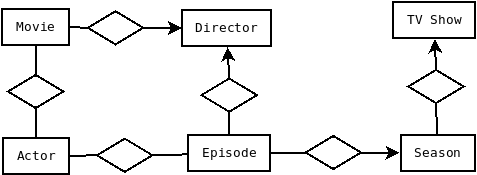

# Challenge backend-nodejs

This challenge aims to evaluate basic skills in Node.js development, and a bit of data/entity modeling. The idea is to build an HTTP REST API.

## Install

Follow these steps to install the project dependencies:

1. Make sure you have Node.js installed on your machine. You can download it from [https://nodejs.org](https://nodejs.org).
2. Open a terminal or command line.
3. Navigate to the root folder of the project.
4. Run the following command to install the dependencies:

    ```bash
    npm install
    ```

## Run the application


Run the following command:
```bash
    npm start
```

## Deployment

The project has been deployed on a server and is available at the following address:

- Frontend: [Frontend address](https://challenge-node-6ae8b.web.app)

## User permits

The application has two types of users with different permissions:

### User "Viewer"

The "Viewer" user has limited permissions and can only view content in the app. She does not have the ability to upload new content or make significant changes. He can perform the following actions:

- Explore and visualize existing content.
- Access search and filter functionalities.
- Interact with existing content, such as leaving comments or ratings.

### User "Admin"

The "Admin" user has additional privileges and can upload and view content. She has the ability to make changes to the app and manage the content. She can perform the following actions:

- All actions allowed to the "Viewer" user.
- Upload new content to the application, such as images, files or data entries.
- Make changes to existing content.
- Manage users and permissions of other users.
- Access administration and configuration functions of the application.

It is important to note that only users with the "Admin" role can perform upload and edit actions. Users with the "Viewer" role will only be able to view existing content.

## Entity Eelationship Model




  